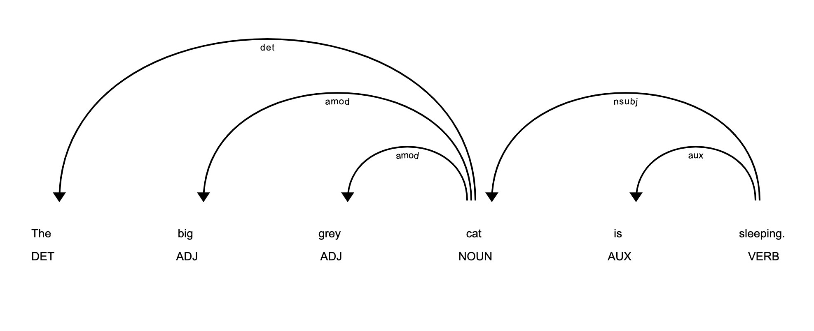
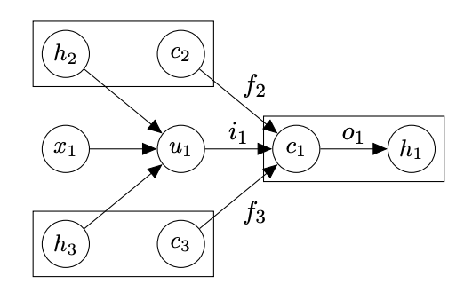
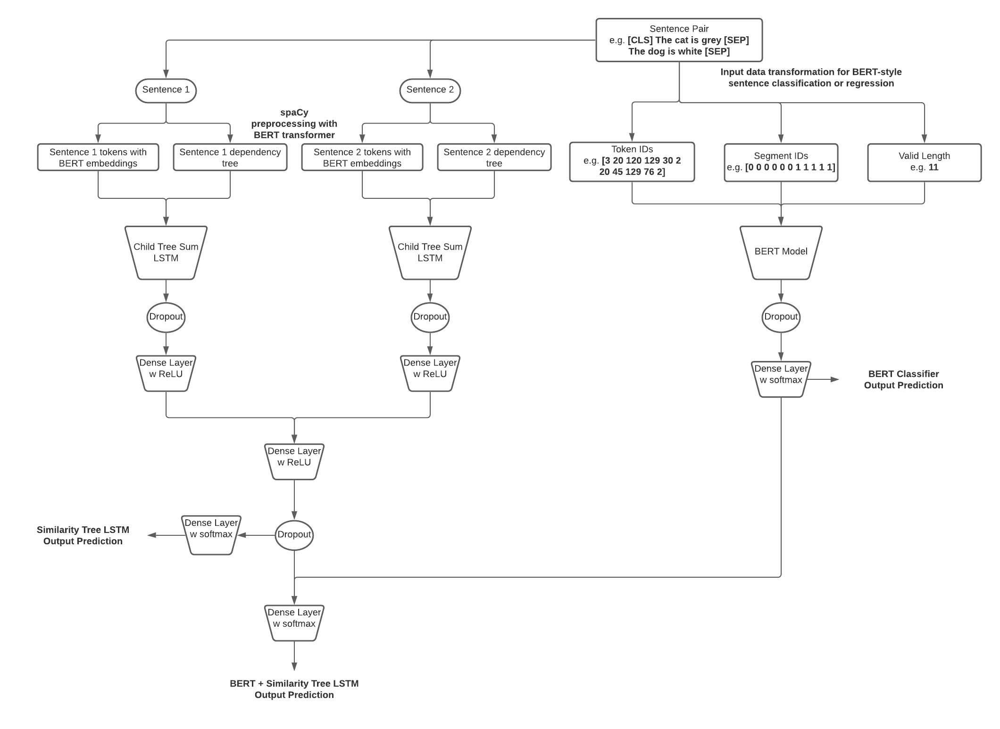

# Engineering a Child-Sum Tree-LSTM with spaCy BERT Dependency Trees

This is a modified implementation of the methods proposed in [Improved Semantic Representations From
Tree-Structured Long Short-Term Memory Networks](https://aclanthology.org/P15-1150.pdf) (Tai et al., 2015) to develop 
LSTM network models with dependency trees as inputs, or Dependency Tree-LSTMs. The salient features of this work are an 
architecture for using spaCy dependency trees with BERT transformer embeddings as the input to a tree LSTM, rather than 
the [Stanford Neural Network Dependency Parser](https://www-nlp.stanford.edu/software/nndep.html) (Chen and Manning, 
2014) with GloVe embeddings as in the original paper.

This implementation is hyperparameter-tuned, trained and tested on the 
[General Language Understanding Evaluation (GLUE) benchmark](https://gluebenchmark.com/) Microsoft Research Paraphrase 
Corpus (MRPC), a sentence paraphrase dataset built from news article that is labeled for whether or not each pair is a 
paraphrase pair.

The primary hypothesis is that BERT embeddings trained and updated in a dependency tree LSTM should give a stronger 
signal in determining whether two sentences are paraphrases of each other as opposed to a plain BERT classifier.

## What are dependency trees?

Dependency trees are potent representations of sentence structure. They give us important syntactic information that 
cannot easily be encoded in a sequential or tabular format, by delineating for us the relationships between words that 
make up sentences. An example of a dependency tree, for the sentence `The big grey cat is sleeping.`, is 
below:



In this example the root verb is `sleeping`, which branches out to its dependents, the noun `cat` and the auxiliary 
verb `is`. The noun `cat` further branches out to its dependents, the determiner `The`, and the adjectives `big` and 
`grey`.

Dependency information has a wide variety of applications in Natural Language Processing. Harnessing this information 
can be as simple as using counts of dependency tags or their n-grams as a proxy for syntactic richness. This particular 
implementation is based on research that attempts to harness the inherent tree structure of dependency parsing to the 
advantage of an LSTM network.

## What is the model architecture?



The foundation of the Dependency-Tree LSTM is the Child-Sum Tree-LSTM cell unit. The difference between the Tree-LSTM 
cell unit and a regular standard LSTM unit is that in a Tree-LSTM unit, the gating vectors `i` and `f` and the memory 
cell `c` are dependent on the hidden and cell states of multiple child units. There are multiple forget gates `f`, one 
for each child unit. The hidden states from multiple child units are summed and transformed to get parent cell and hidden 
states in a Child-Sum Tree-LSTM. This allows the Tree-LSTM unit to selectively exclude information from each child unit. 
In this way, it could learn to prioritize certain dependency children more than others, e.g. adverbial clauses vs. 
determiners in trying to determine semantic relatedness.

The input `x` for each Tree-LSTM cell unit, in our case, is the spaCy BERT embedding for the particular token from the 
pooled output of the spaCy BERT model.



There are three variations in model architecture that are implemented in this work for comparison, the `Similarity Tree 
LSTM`, which is composed solely of Child-Sum Tree-LSTM cells, the `BERT Classifier` model, which is a plain BERT 
classifier model consisting of a dropout and dense layer applied on the pooled output of a BERT language model, and a 
combined `BERT + Similarity Tree LSTM` model. The architecture of these models is illustrated in the diagram above.

The dense layers are followed by ReLU, a simple and effective activation function with sparse activation. Softmax 
activation is applied on the final dense layers of two dimensions and cross-entropy loss is computed on that output.

## Training

Install `requirements.txt` for required Python packages. Run `train.py` for random hyperparameter search, training and 
testing.

This package has three modes: `train-randomsearch`, `train` and `predict` and three model types: `bert`, 
`bert+treelstm` and `treelstm`. 

Running in `train-randomsearch` performs a 
random hyperparameter search on the following parameters:
* `--no-layers-to-freeze`, number of BERT layers to freeze: 3, 7, 10
* `--initializer`, initializer for Tree-LSTM and dense layer weights: xavier, normal
* `--dropout`, dropout value: 0.2, 0.5, 0.9
* `--batch-size`, number of samples fed into the neural network at a time: 16, 32, 64
* `--learning-rate`, learning rate for neural network: 0.001, 0.0001, 0.00001, 0.000001, 0.0000001
* `--weight-decay`, regularization parameter by which the sum of squares of the model parameter weights are multiplied 
  and then added to the loss: learning_rate / 1000, learning_rate / 100, learning_rate / 10

The number of permutations to be performed with these parameters can be specified using `--permutations`.

### Random Search mode
To run in `train-randomsearch` mode for the `bert+treelstm` model type with 10 random permutations of the 
hyperparameters with 10 epochs each, specify the parameters like so:
```
python3 train.py --model-type bert+treelstm --model train-randomsearch --epochs 10 --permutations 10
```
No experiment name is required; it will be automatically constructed with the model type and hyperparameters used in 
each permutation.

The train and validation losses and accuracies will get saved in files with names ending with `_losses_and_acc.csv` and 
the model parameters will get saved in `_best.params`. The validation accuracies for each set of hyperparameters will 
get saved in `randomsearch_results.txt`.

### Train mode

To run in `train` mode, specify all the hyperparameters unless using the default ones, like so:
```
python3 train.py --experiment-name bert+treelstm_train --mode train --epochs 30 --model-type bert+treelstm --no-layers-to-freeze 3 --initializer normal --dropout 0.2 --batch-size 64 --learning-rate 0.000001 --weight-decay 0.00000001
```

The train and validation losses and accuracies will get saved in files with names ending with `_losses_and_acc.csv` and 
the model parameters will get saved in `_best.params`. The test accuracy, F1 score, loss and confusion matrix will 
get saved in `test_results.txt`.

### Predict mode

To run in `predict` mode, specify just the experiment name and mode:
```
python3 train.py --experiment-name bert+treelstm_train --mode predict
```
The test accuracy, F1 score, loss and confusion matrix will 
get saved in `test_results.txt`.

## Analysis of Results

## Future Work
* Replace ReLU with [Leaky ReLU](https://ayearofai.com/rohan-4-the-vanishing-gradient-problem-ec68f76ffb9b) to address 
the dying ReLU problem which might be happening with some parameter settings in the random search
* Replace softmax activation on the output dense layer in two dimensions with a sigmoid activation on a dense layer 
in one dimension for faster modeling
* Try deeper networks, i.e. with more dense layers
* Make use of N-ary Tree-LSTMs (as mentioned in Tai et al.) and constituency parsing rather than Child-Sum Tree-LSTMs 
  and dependency parsing; in N-ary Tree-LSTMs the order of the children is taken into consideration which allows 
  constituency trees, where constituent sub-phrases of the same type are on the same side of the parent, to be harnessed 
  more richly
